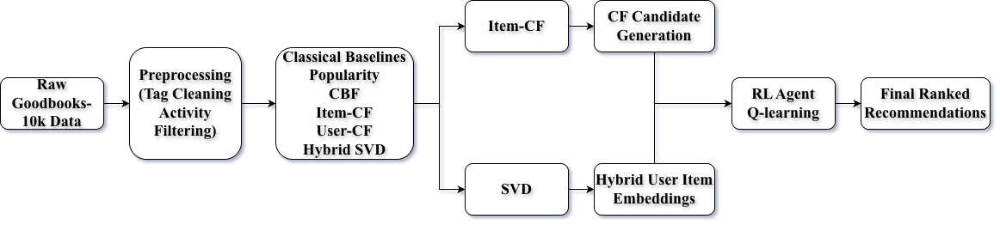

# 📚 Goodbooks Recommendation System

## Overview

This project implements and deploys a multi-model book recommendation system built on the **Goodbooks dataset**.  
The goal is to explore, compare, and productionize different recommendation strategies — from classical collaborative filtering to a reinforcement learning–based reranker — while making deliberate engineering tradeoffs for real-world deployment.

The live demo is designed as an **interactive system**, not just an offline experiment.

---

## Dataset

- **Source:** Goodbooks dataset
- **Scale:** ~20,000 users, ~8,800 books, ~2.7M interactions
- **Feedback:** Explicit ratings (1–5)
- **Metadata:** Titles, authors, genres, tags

### Preprocessing
- Filtered sparse users and items
- Mapped book IDs consistently across ratings and metadata
- Split interactions into train / validation / test
- Built auxiliary structures for fast inference (Top-K matrices, embeddings)

---

## Models Implemented

### 1️⃣ Popularity Baseline
Recommends globally popular books based on interaction counts and mean ratings.

---

### 2️⃣ User-Based Collaborative Filtering (User-CF)
Recommends books liked by similar users.

**Implementation:**
- User–user similarity matrix
- Top-K neighbors retained per user

**Note:**  
The full dense similarity matrix is too large for live deployment(~3GB) and is optimized using Top-K truncation.

---

### 3️⃣ Item-Based Collaborative Filtering (Item-CF)
Recommends books similar to books a user has interacted with.

**Two modes:**
- User-based recommendations (via history aggregation)
- Item-to-item similarity (“Find similar books”)

---

### 4️⃣ Matrix Factorization (SVD)
Latent factor model that embeds users and items into a shared space.

**Strengths:**
- Captures global structure
- Smooths sparsity
- Fast inference

This model serves as a strong mid-complexity baseline.

---

### 5️⃣ Content-Based Filtering (TF-IDF)
Recommends books based on textual similarity of titles and authors.

**Implementation:**
- TF-IDF vectorization (precomputed offline)
- Cosine similarity at inference time
- Seeded by one or more books

**Use case:**  
- Cold-start users
- Explainable, preference-driven recommendations

---

### 6️⃣ Reinforcement Learning Reranker
A learned policy that reranks candidate recommendations for a user.

**Key Idea:**  
Instead of generating recommendations from scratch, RL learns how to **reorder candidates** to maximize downstream reward.

**Design:**
- State: user embedding + item embedding + neighborhood context
- Action: rank adjustment
- Trained offline, deployed as a lightweight inference model

---

### 7️⃣ Hybrid Model (CF + RL)
The best-performing system in this project.

**How it works:**
1. Item-CF generates a large candidate set
2. RL reranker reorders candidates
3. Final score blends CF similarity and RL output

This combines **retrieval quality** with **personalized ranking**.

---

## Evaluation

Models were evaluated offline using standard recommendation metrics:

- **HR@5 (Hit Rate)**
- **NDCG@5**
- **Precision@5**

The Hybrid model consistently outperformed baselines across metrics.

---

## Personas and User Simulation

Since the live demo does not have real users, the app uses **representative personas**:

- Fantasy Fan
- Sci-Fi Enthusiast
- History Reader
- Romance Reader
- Mystery / Thriller
- YA / Teen Reader
- Classics Lover

Each persona corresponds to a **real user ID** from the dataset with strong genre concentration.  
This allows meaningful personalization without authentication or data storage.

---

## Deployment Design Decisions

### Why some models are not fully deployed
- Full User-CF similarity matrix was ~3GB
- Streamlit Community Cloud has a **1GB memory limit**

**Solution:**  
- Convert dense matrices into **Top-K sparse representations**
- Drop redundant models from the live demo
- Keep full versions available for local experimentation

---

### Memory & Performance Optimization
- Precompute heavy artifacts offline
- Use NumPy + SciPy sparse formats
- Lazy-load RL components only when needed
- Cache artifacts using `st.cache_resource`

---

## System Architecture

1. Offline training & preprocessing
2. Artifact serialization (Top-K matrices, embeddings, models)
3. Streamlit UI layer
4. Shared inference layer (`multimodel.py`)
5. Model comparison & visualization

---
Refer to the documentation of this project in the git repository.

